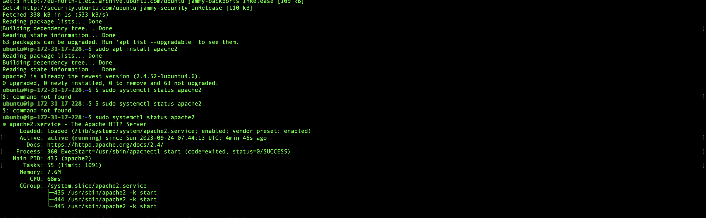

# LAMP STACK IMPLEMENTATION (Linux ,Apache ,MySQL and PHP)

## Prerequisites

>To prepare for this project, you will need an AWS account and a virtual server running Ubuntu Server OS.

>Here's a summary of the steps:

>Prerequisites: You need an AWS account and an Ubuntu Server virtual server.

>AWS Account: You can sign up for a free AWS account.

>EC2 Instance: AWS provides a free virtual server called EC2 (Elastic Compute Cloud) for your project.

>Setup: You can either watch instructional videos or follow written instructions to set up your AWS account and provision an Ubuntu Server on EC2.

In summary, the first step is to ensure you have the necessary AWS account and server to proceed with the project.

+ Cloud Service Provider - AWA, AZURE, GOOGLE CLOUD e.t.c
+ Launch a Linux instance (preferably UBUNTU)
+ Prior knowledge on how to link SSH into a virtual host

## **STEP 1 - Installing Apache Web Browser**

### _**Installing Apache and updating the firewall**_

>Install Apache using _Ubuntu_ package manager

`apt`

>Next is that we need to update the list of packages in the package manager

`sudo apt update`

>Now, lets run the `apache2` package installation

`sudo apt install apache2`

>Let's run a check to confirm what we just installed, this can be checked by using

`sudo systemctl status apache2`

>Let's test how our _apache HTTP_ can respond to requests from the internet, to do this, we run 

`http://<Public-IP-Address>:80`

## **STEP 2 - Installing MYSQL**

>Now that we have a web server up and running, we need to install a _Database Management System (DBMS)_ to be able to store and manage data for my site in a relational database. **MySQL** is a popular relational database management system used within PHP environments.

> To acquire and install this software, we would run

`sudo apt install mysql`

To confirm what we just installed ,lets run

`sudo mysql`

Now, run the pre-installed MySQL security script to enhance security by eliminating insecure defaults and securing database access. Before executing the script, ensure you set a password for the root user, using 'mysql_native_password' as the default authentication method; for instance, we're defining this user's password as _**'PassWord'.1_**

`ALTER USER 'root'@'localhost' IDENTIFIED WITH mysql_native_password BY 'PassWord.1';`

To exit _mysql_ mode,

`mysql> exit`

To start the interactive script, run

`$ sudo mysql_secure_installation`

+ After configuring the VALIDATE PASSWORD PLUGIN, you'll be prompted to create a password for the MySQL root user. This user has full administrative privileges within the database.

+ Although the default authentication method may not require a password, it's advisable to set a strong one for added security.

+ If you enabled password validation, you'll see a strength assessment for your chosen root password. Confirm it by entering 'Y' if you're satisfied.

+ This step ensures a robust root password for enhanced system security.

To test if we are able to login to mysql console, run

`sudo mysql -p mysql_username -u`

___

## **STEP 3 - Installing PHP**

+ Your server setup includes Apache for content delivery and MySQL for data storage and management.

+ PHP plays a crucial role by processing code to generate dynamic content for users.

+ To enable PHP to interact with MySQL databases, ensure you have both the 'php-mysql' module and 'libapache2-mod-php' installed.

+ Core PHP packages will be automatically installed as dependencies for seamless functionality.

> To install the 3 - packages, run these

`$ sudo apt install php libapache2-mod-php php-mysql`

`php -v`

> PHP 7.4.3 (cli) (built: Oct  6 2020 15:47:56) ( NTS )
> Copyright (c) The PHP Group
> Zend Engine v3.4.0, Copyright (c) Zend Technologies

## **Step 4 - Creating a Virtual Host for your Website using Apache**

+ In this project, you'll establish a domain named `projectlamp` but feel free to use any domain you prefer.

+ Ubuntu 22.04 comes with Apache, which initially serves content from the /var/www/html directory. We won't alter this default setup.

+ Instead, we'll create a new directory alongside the default one to house the content for "project lamp."

+ To do this, you can use the `mkdir` command as shown below.

> Create the directory for project lamp using `mkdir` command as follows

`$ sudo mkdir /var/www/projectlamp`

> Next, assign ownership of the directory with the $USER environment variable, which will reference your current system user:

`$ sudo chown -R $USER:$USER /var/www/projectlamp`

> Then, create and open a new configuration file in Apache's sites-available directory using your preferred command-line editor. Here, we'll be using vi or vim (They are the same by the way)

`$ sudo vi /etc/apache2/sites-available/projectlamp.conf`

This will create a new blank file. Paste in the following bare-bones configuration by hitting on i on the keyboard to enter the insert mode, and paste the text:

<VirtualHost *:80>

ServerName projectlamp

ServerAlias www.projectlamp

ServerAdmin webmaster@localhost

DocumentRoot /var/www/projectlamp

ErrorLog ${APACHE_LOG_DIR}/error.log

CustomLog ${APACHE_LOG_DIR}/access.log combined

</VirtualHost>

> To save and close the file simple follow the below steps:

1. Hit the esc button on the keyboard
2. Type:
3. Type wq. wfor write and qfor quit
4. Hit ENTER to save the file

> Now let's use the `ls` command to show the new file in the sites-available directory

`$ sudo ls /etc/apache2/sites-available`

> With this VirtualHost configuration, we're telling Apache to serve project_lamp using /var/www/project_lamp as its web root directory. If you would like to test 
Apache without a domain name, you can remove or comment out the options Server Name and ServerAlias by adding a # character in the beginning of each 
option's lines. Adding the # character there will tell the program to skip processing the instructions on those lines.

**Now let us use _a2ensite_ command to enable the new virtual host**

`$ sudo a2ensite projectlamp`

> You might want to disable the default website that comes installed with Apache. This is required if you're not using a custom domain name, because in this case 
Apache's default configuration would overwrite your virtual host. To disable Apache's default website use a2dissite command, type

`$ sudo a2dissite 000-default`

> To make sure your configuration file doesn't contain syntax errors, run

`$ sudo apache2ctl configtest`

> Finally, reload Apache so these changes take effect:

`$ sudo systemctl reload apache2`

> Your new website is now active, but the web root **/var/www/projectlamp** is still empty. Create an **index.html** file in that location so that we can test that the virtual host works as expected:

`sudo echo 'Hello LAMP from hostname' $(curl -s http://169.254.169.254/latest/meta-data/public-hostname) 'with public IP' $(curl -s http://169.254.169.254/latest/meta-data/public-ipv4) > /var/www/projectlamp/index.html`

> Now go to your browser and try to open your website URL using IP address:

`http://<Public-IP-Address>:80`

## **Step 5 - Enable PHP on the website**

> By default, Apache prioritizes displaying an _index.html_ file over an _index.php_ file. This feature is useful for temporarily setting up maintenance pages in PHP applications. You can create a temporary _index.html_ page with a message for visitors, and it will become the main landing page during maintenance. After completing maintenance, you can either rename or delete the _index.html_ file from the document root to revert to the regular application page. If you wish to change this behavior, you'll need to modify the order in which 'index.php' is listed within the DirectoryIndex directive in the `/etc/apache2/mods-enabled/dir.conf` file.

`sudo vim /etc/apache2/mods-enabled/dir.conf`

> <IfModule mod_dir.c>
        #Change this:
        #DirectoryIndex index.html index.cgi index.pl index.php index.xhtml index.htm
        #To this:
        DirectoryIndex index.php index.html index.cgi index.pl index.xhtml index.htm
</IfModule>

> After saving and closing the file, you will need to reload Apache so the changes take effect:

`$ sudo systemctl reload apache2`

> Finally, we will create a _PHP_ script to test that _PHP_ is correctly installed and configured on your server.
Now that you have a custom location to host your website's files and folders, we'll create a _PHP_ test script to confirm that Apache is able to handle and process requests for _PHP_ files.

`$ vim /var/www/projectlamp/index.php`

> This will open a blank fle Add the following text which is valid PHP code inside the file This will open a blank file. Add the following text, which is valid PHP code, inside the file:

`<?php phpinfo();`

